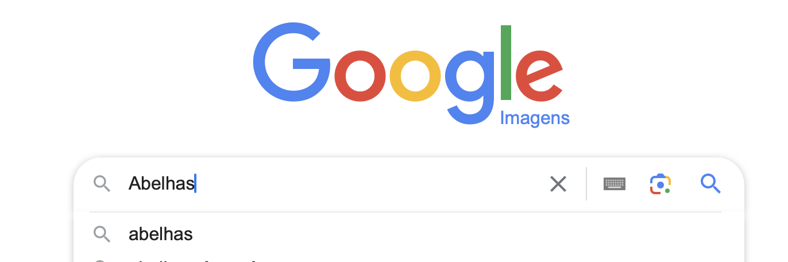
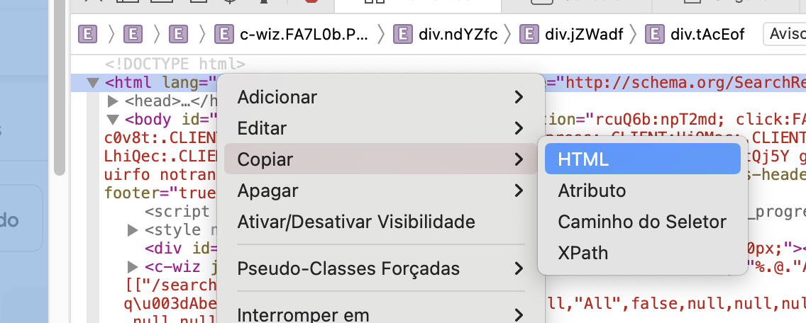

# GOOGLE IMAGES DOWNLOAD
ℹ️ This script was created for educational proposal
<br><br>
To test the code open the Colab Notebook<br>
https://colab.research.google.com/drive/1O5yURD_T9trbX9x-BcfBVfERRT7ke6Gh?usp=sharing
## Install
Clone the repository
```
git clone https://github.com/eduardoseity/google-images-download.git
```
## How it works
The script needs an html file with the code of the searched images page.<br>
The script will read this file and extract all the image tags containing relevant pictures.<br>
This tags are used to get the link or the base64 code of images.<br>
The images are saved in predefined folder.
## How to use
1. Access <a href="https://images.google.com" target="_blank">https://images.google.com</a>
2. Type the search term and hit Enter<br>
3. Scroll the page down until all images are loaded<br>
4. Open the Developer Tools of your browser<br><br>
Windows: Ctrl + Shift + I or F12<br>
macOS: ⌘ + ⌥ + I<br>
5. In Elements tab right click on the first <html> tag and copy as HTML<br>
6. Paste the content in a text editor and save the file as index.html
7. Move the file index.html to root directory of this project
8. Once you have index.html file you can run the command line
```python3 GoogleImagesDownload.py```
This command will extract all the images and save on `dataset/images` folder
## Usage
```
python3 GoogleImagesDownload.py -i="index.html" -o="datasets/images"
```
Arguments:<br>
`-i` or `--input`: the html file<br>
`-o` or `--output`: the output folder where images will be saved
